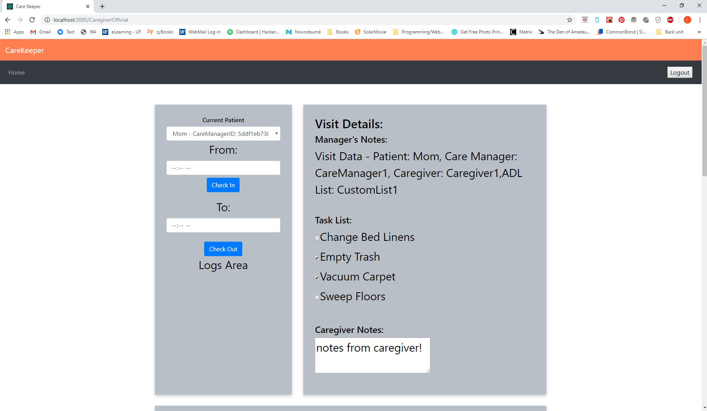

## Getting Started

This repository is for the carekeeper application made for Jayme Hickman Lindsey. Application that helps families manages the care of a loved one with Alzheimer’s or Dementia. The web app will help facilitate communication between paid caregivers and care managers. Our goal is to have it be able to track activities of daily living, medications, doctor appointments, and caregiver schedule.

#### _**DEPLOYED SITE**_ -
[Carekeeper link](https://carekeeper.herokuapp.com/)

#### _**RUNNING THE WEBSITE**_ -

*Heroku:*

by clicking the link you are able to view the working website. The web app is deployed using the master branch.

*Locally:*  

First run `npm run-script install-all` from the root.

To get all features running locally first go to the Okta main account (provided to the web app manager) and under applications >> Care Keeper >> General >> Edit. Once here update the "Login redirect URIs" and "Initiate login URI" to http://localhost:3000/implicit/callback

Once this is done the application can be run locally with the command `npm run-script dev`

#### _**FEATURES**_ -

This application has 6 features:

<<<<<<< HEAD

*React Calendar* - The application allows the caremanager and the caregiver the ability to add a patient's appointment to the Caremanager's corresponding calendar. 
=======
*React Calendar* - The application allows the caremanager and the caregiver the ability to add a patient's appointment to the Caremanager's corresponding calendar.
>>>>>>> 3988cd0518694159882a9fc4aeef7fe404ac5714

*Login* - Caremanagers and caregivers have their own credentials that will redirect them to their personalized caregiver/caremanager page. Caremanagers and caregivers must be invited directly by the application manager from the Okta organization page.

*Activities of Daily Living list (ADL)* - Activities of daily living are activities required to be completed by the caregiver for each patient. The personalized list is displayed on the care giver's page. The caregiver is then able to check off the completed items and it will be updated in the patient profile in real time.

*Patient Profile* - Caregivers can add patients to their managed list and link each patient to a particular care manager. Once linked the care manager is able to see the specifications of each patient in their corresponding care manager page. Patient profiles include: a personalized ADL list, nickname for each patient, and any additional notes added by either the caremanager or caregiver. Patient profiles are stored in MongoDB Atlas.

*Caregiver Schedule* - Caremanagers will have the ability to assign a schedule for the caregiver. This schedule will be displayed in the caregiver's page.

*Log-in/Log-out* - A log-in and log-out feature is displayed in the caregiver's page. Each log-in/log-out is saved to the caregiver's profile on MongoDB.

*CVS Export* - Caremanagers will have the ability export the patient information (such as ADLs) in a cvs format.  

#### _**UPDATING DB AND SERVER CONNECTIONS**_ -

*Two ways to update the database:*
    1) Directly through the MongoDB Atlas login
    2) By modifying the server models in the application

*Server Connections:*
    When running locally, the client (front-end) runs on port 3000 and the server (back-end) runs on port 5000. Heroku requires the application to run on port 8000.

    Backend connections can be found in server >> server.js and

#### _**CREDIT**_ -
This project was built from the [UFWebApps/Mern-Template](https://github.com/UFWebApps/MERN-Template)

This project was bootstrapped with [Create React App](https://github.com/facebook/create-react-app).

The following API's were used in the project:

    Okta Authentication API
    React-Calendar
    Reactstrap

## Available Scripts

In the project directory, you can run:

### `npm run-script dev`

Runs both the client app and the server app in development mode.
Open [http://localhost:3000](http://localhost:3000) to view the client in the browser.

### `npm run-script client`

Runs just the client app in development mode.
Open [http://localhost:3000](http://localhost:3000) to view the client in the browser.

### `npm run-script server`

Runs just the server in development mode.

### `npm run build`

Builds the app for production to the `build` folder.
It correctly bundles React in production mode and optimizes the build for the best performance.

If deploying to heroku this does not need to be run since it is handled by the heroku-postbuild script

See the section about [deployment](https://facebook.github.io/create-react-app/docs/deployment) for more information.
